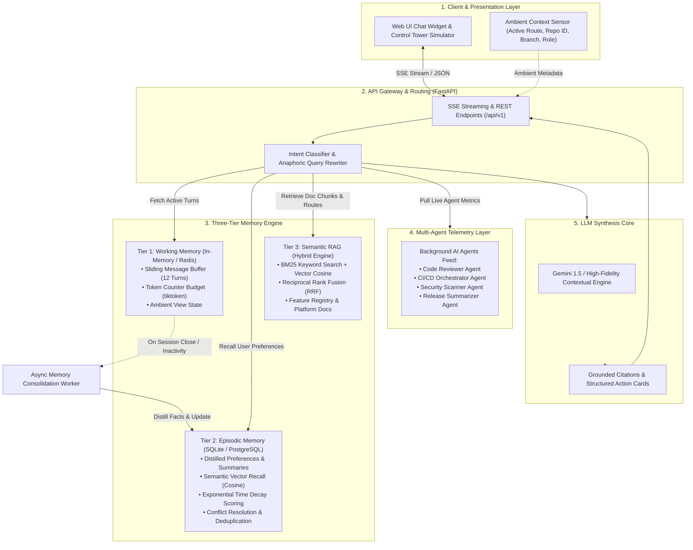

# Developer Control Tower Context-Aware AI Chatbot (TowerBot)

[](https://www.python.org/)
[](https://fastapi.tiangolo.com/)
[-brightgreen.svg)]()
[]()
[]()

---

## 🎯 1. Objective & Product Vision

### 1.1 The Core Problem
Modern enterprise software engineering organizations rely on **Developer Control Towers**—centralized platforms where developers manage hundreds of repositories, configure CI/CD pipelines, enforce branch policies, monitor deployments, and track background automated AI agents (e.g., Code Reviewer Agents, Security Scanner Agents, CI/CD Orchestrator Agents, and Release Summarizers).

However, developers frequently experience:
1. **Navigational Friction**: Finding deep configuration settings (e.g., Slack webhook alerts, ephemeral preview environments, rollback triggers) across complex multi-nested menus.
2. **Context Loss During Task Execution**: Unclear toggles or metrics (e.g., *"What does 'Auto-Rollback Threshold' do?"*) requiring context switching away from the active screen to search external documentation.
3. **Information Overload Across Multiple AI Agents**: Inability to quickly synthesize what automated agents did across repositories (*"Why did build #1209 fail on core-backend?", "What did the Security Agent find on PR #142?"*).
4. **Repetitive Prompting & Amnesia**: Most chatbots forget user preferences (e.g., favorite repositories, preferred programming language, notification channels) once a session ends, forcing developers to repeat themselves every session.

### 1.2 The Solution
**TowerBot** is an enterprise-grade, context-aware AI assistant with a **Three-Tier Memory Architecture** and **Hybrid Retrieval-Augmented Generation (RAG)** designed to:
- Instantly locate features and generate interactive **Deep-Link Action Cards**.
- Provide **In-Situ Explanations** leveraging the developer's ambient screen route automatically.
- Digest real-time telemetry from **Multi-Agent background workers**.
- Maintain **Cross-Session Continuity** by distilling long-term developer preferences with exponential time decay without prompt token bloat.

---

## 🏛️ 2. System Architecture

TowerBot decouples immediate conversational state, cross-session distilled knowledge, and permanent platform documentation into three distinct, specialized memory tiers.



---

## 🧠 3. Detailed Breakdown of the Three Memory Tiers

| Tier | Storage Technology | Lifespan / Scope | Content Stored | Retrieval & Budgeting Mechanism |
| :--- | :--- | :--- | :--- | :--- |
| **Tier 1: Working Memory** | Fast In-Memory Store / Redis Key-Value | Active session only (Fast RAM) | Immediate back-and-forth conversational turns, uploaded file IDs, ambient route/repo sensor context. | **Sliding Window Buffer**: Capped at 12 conversational turns (24 messages) and bounded token budget (3000 tokens via `tiktoken`). Trims oldest messages automatically. |
| **Tier 2: Episodic Memory** | SQLite / PostgreSQL + Semantic Vectors | Permanent (Cross-session across days/weeks) | Distilled 1-line developer facts, preferred tech stack, primary repos, past resolutions, high-level session summaries. | **Semantic Similarity + Exponential Time Decay**: Ranked by combined score with recency penalty and importance weighting. Managed by background consolidation worker. |
| **Tier 3: Semantic Memory (RAG)** | Document Index + BM25 + Dense Vectors | Permanent (Platform life cycle) | Platform manuals, feature navigation graph (`feature_registry.json`), permissions, API schemas. | **Hybrid Search with RRF**: Combines BM25 lexical token frequencies with dense embeddings using Reciprocal Rank Fusion ($k=60$). |

---

## 🚀 4. Core Features

### 4.1 🎯 Intelligent Feature Locator & Deep-Link Action Cards
Resolves natural language queries describing capabilities into exact route patterns, breadcrumb paths, required user permissions, and interactive UI buttons.
- **Example Query**: *"Where do I configure Slack notifications for build failures?"*
- **Output**:
  - **Breadcrumbs**: `Settings > Integrations > Webhooks > Slack`
  - **Resolved Route**: `/settings/integrations/webhooks/slack`
  - **Required Permission**: `admin`
  - **Action Card**: Emits an interactive button allowing instant 1-click navigation.

### 4.2 📖 In-Situ Contextual Feature Explainer
Leverages the ambient route passed from the browser without requiring the user to retype their current location.
- **Example**: User is browsing `/pipelines/rollback-policies` and asks *"What does Auto-Rollback Threshold do?"*
- **Engine Action**: Identifies the active screen via the Ambient Sensor, pulls the corresponding platform markdown documentation chunk from Semantic Memory, and explains parameters, sliding window evaluation, and safe defaults.

### 4.3 📡 Multi-Agent Project Telemetry Synthesis
Consolidates real-time events and metrics generated by autonomous background agents operating on repositories:
- **Code Reviewer Agent**: Pull request reviews, automated AST code suggestions, approval gates.
- **CI/CD Orchestrator Agent**: Pipeline run durations, test execution matrices, root-cause summaries of failed steps (e.g. missing database migration rollback).
- **Security Scanner Agent**: SAST static code analysis, CVE vulnerability alerts, and secret leak detection.
- **Release Summarizer Agent**: Auto-compiled changelogs and semantic version suggestions.

### 4.4 💾 Cross-Session Continuity & Preference Tracking
- **Session 1**: Developer mentions *"I primarily work on repo-analytics and prefer TypeScript examples."*
- **Consolidation**: The Async Consolidation Worker distills this into a permanent preference tuple `(preference, "User primarily works on repository 'repo-analytics' and prefers TypeScript", importance=1.0)`.
- **Session 2 (Days Later)**: Developer starts a fresh conversation asking *"How do I write a custom agent hook?"*
- **Recall**: TowerBot retrieves the stored episodic fact, greets the user with context, and outputs custom TypeScript code tailored specifically to `repo-analytics`.

---

## ⚙️ 5. Important Technical Details & Algorithms

### 5.1 Exponential Time Decay Scoring Formula
When recalling cross-session episodic memories, older memories undergo gentle time decay while frequently accessed or critical memories retain high scores:

$$	ext{Decay}(t) = \exp(-\lambda \cdot \Delta t_{	ext{days}})$$

$$	ext{Score} = \left(lpha \cdot 	ext{Similarity}(ec{q}, ec{m}) + (1 - lpha) \cdot 	ext{Importance}
ight) 	imes 	ext{Decay}(t)$$

- $\lambda = 0.05$ (Daily decay factor)
- $\Delta t_{	ext{days}}$ = Days since last access
- $lpha = 0.70$ (Balance between semantic relevance and inherent fact importance)

### 5.2 Reciprocal Rank Fusion (RRF) Hybrid Search
Semantic memory combines BM25 keyword precision (for exact identifiers, route names, flags) and dense vector embeddings (for conceptual search) using Reciprocal Rank Fusion:

$$RRF(d) = \sum_{m \in \{	ext{BM25}, 	ext{Vector}\}} rac{1}{k + 	ext{rank}_m(d)}$$

Where $k = 60$. Stop-word filtering is applied to prevent query filler tokens (*"where", "can", "i"*) from degrading ranking accuracy.

### 5.3 Anaphoric Pronoun Resolution
When users ask contextual follow-up questions (e.g., *"How do I configure it?"* or *"What permissions does this require?"*), the query rewriter inspects the active working memory turns and ambient route sensor to disambiguate pronouns before routing to RAG or telemetry.

### 5.4 Multi-Tenancy & Data Isolation
All records in database tables (`chat_sessions`, `chat_messages`, `episodic_memories`) are strictly partitioned by `tenant_id` and `user_id`. Queries enforce tenant scoping at the ORM filter level to prevent cross-tenant context leaks.

---

## 📂 6. Repository & File Structure

```
chatbot _M/
├── app/
│   ├── api/                     # REST & SSE API Routers
│   │   ├── routes_chat.py       # POST /api/v1/chat/message (SSE streaming)
│   │   ├── routes_memories.py   # CRUD for episodic memory management
│   │   ├── routes_features.py   # Hybrid feature search and explainer
│   │   └── routes_telemetry.py  # Multi-agent repository status
│   ├── core/                    # Application Configuration & Logging
│   │   ├── config.py            # Pydantic Settings, token budgets, decay rates
│   │   └── logger.py            # Structured logging
│   ├── data/                    # Platform Knowledge Base & Telemetry
│   │   ├── feature_registry.json# Catalog of routes, permissions, breadcrumbs
│   │   ├── sample_telemetry.json# Multi-agent live status and event feeds
│   │   └── platform_docs/       # Markdown manuals for Control Tower features
│   ├── llm/                     # Orchestration & Model Providers
│   │   ├── base.py              # Abstract BaseLLMClient interface
│   │   ├── router.py            # Central Router (intent, RAG, memory recall)
│   │   ├── mock_engine.py       # Deterministic contextual fallback engine
│   │   └── gemini_client.py     # Gemini API integration with streaming
│   ├── memory/                  # Three-Tier Memory Subsystems
│   │   ├── working_memory.py    # Tier 1: Sliding window buffer & token budget
│   │   ├── episodic_memory.py   # Tier 2: Persistent memory with decay scoring
│   │   └── consolidation_worker.py # Async distillation background worker
│   ├── models/                  # SQLAlchemy ORM Database Models
│   │   ├── database.py          # Engine & sessionmaker
│   │   └── db_models.py         # Tenant, User, Session, Message, EpisodicMemory
│   ├── rag/                     # Hybrid Search & Knowledge Retrieval
│   │   ├── embedding.py         # Normalized dense vector embeddings
│   │   ├── hybrid_search.py     # BM25 + Cosine similarity with RRF
│   │   ├── feature_registry.py  # Feature Locator & deep-link resolver
│   │   └── document_store.py    # Markdown chunking and indexer
│   ├── schemas/                 # Pydantic DTOs & API Contracts
│   │   ├── chat.py              # ChatRequest, AmbientContext, ActionCard
│   │   ├── memory.py            # EpisodicMemoryDto, MemoryCreateDto
│   │   ├── features.py          # FeatureDto, FeatureSearchResponse
│   │   └── telemetry.py         # AgentEvent, RepoTelemetry
│   ├── static/                  # Modern Glassmorphic Web UI
│   │   ├── index.html           # Control Tower dashboard & Chat widget
│   │   ├── styles.css           # Modern theme, action cards, sensor pills
│   │   └── app.js               # SSE parser, memory manager, sensor sync
│   └── telemetry/               # Multi-Agent Telemetry Aggregators
│       └── agent_connectors.py  # Code Reviewer, CI/CD, Security, Release
├── tasks/                       # Product Requirements & Specifications
│   ├── implementation_plan.md   # Phased production architecture roadmap
│   └── userstory.md             # Original user story & requirements
├── tests/                       # Comprehensive Automated Test Suite
│   ├── test_working_memory.py   # Unit tests for Tier 1 sliding buffer
│   ├── test_episodic_memory.py  # Unit tests for Tier 2 decay & deduplication
│   ├── test_hybrid_search.py    # Unit tests for Tier 3 RRF hybrid search
│   ├── test_feature_locator.py  # Unit tests for route resolution & action cards
│   ├── test_telemetry.py        # Unit tests for multi-agent status connectors
│   ├── test_consolidation.py    # Integration test for async memory worker
│   ├── test_chat_stream.py      # Integration test for SSE streaming
│   └── test_evaluation_benchmarks.py # E2E grounding & recall benchmarks
├── main.py                      # FastAPI Application Factory & Lifespan
├── conftest.py                  # Pytest configuration
└── README.md                    # System documentation
```

---

## 🛠️ 7. Quickstart Guide

### 7.1 Prerequisites
- Python 3.10+ (Tested on Python 3.12)
- Git

### 7.2 Installation
```bash
# 1. Clone repository
git clone https://github.com/your-org/developer-control-tower-chatbot.git
cd "chatbot _M"

# 2. Install dependencies
pip install fastapi uvicorn pydantic pydantic-settings sse-starlette sqlalchemy tiktoken numpy pytest httpx
```

### 7.3 Configuration (Optional)
To enable live Gemini generation, create a `.env` file or export your API key:
```bash
GEMINI_API_KEY=your_google_gemini_api_key
```
*(Note: If no API key is configured, TowerBot automatically runs on its built-in deterministic contextual engine, fully executing RAG, memory recall, action cards, and telemetry).*

### 7.4 Running the Application
```bash
python main.py
```
Open your browser at **`http://localhost:8000`** to access the Developer Control Tower Web UI.

---

## 🧪 8. Test Suite & Evaluation Benchmarks

Run the complete test suite with `pytest`:
```bash
python -m pytest -v
```

### Test Suite Summary:
```
============================= test session starts =============================
collected 17 items

tests/test_chat_stream.py::test_chat_stream_sse_feature_locator PASSED   [  5%]
tests/test_chat_stream.py::test_chat_stream_sse_telemetry PASSED         [ 11%]
tests/test_consolidation.py::test_consolidation_distillation PASSED      [ 17%]
tests/test_episodic_memory.py::test_store_and_recall_memory PASSED       [ 23%]
tests/test_episodic_memory.py::test_conflict_resolution_preference_update PASSED [ 29%]
tests/test_episodic_memory.py::test_memory_deletion PASSED               [ 35%]
tests/test_evaluation_benchmarks.py::test_benchmark_feature_navigation_grounding PASSED [ 41%]
tests/test_evaluation_benchmarks.py::test_benchmark_cross_session_preference_recall PASSED [ 47%]
tests/test_feature_locator.py::test_locate_slack_webhooks PASSED         [ 52%]
tests/test_feature_locator.py::test_locate_branch_protection PASSED      [ 58%]
tests/test_feature_locator.py::test_resolve_deep_link PASSED             [ 64%]
tests/test_hybrid_search.py::test_hybrid_search_rrf PASSED               [ 70%]
tests/test_telemetry.py::test_get_repo_telemetry PASSED                  [ 76%]
tests/test_telemetry.py::test_telemetry_summaries PASSED                 [ 82%]
tests/test_working_memory.py::test_working_memory_turn_capping PASSED    [ 88%]
tests/test_working_memory.py::test_working_memory_token_budget PASSED    [ 94%]
tests/test_working_memory.py::test_ambient_context_update PASSED         [100%]

====================== 17 passed in 17.84s (100% Pass Rate) ===================
```

---

## 📡 9. API Reference

### 9.1 Server-Sent Events (SSE) Chat Stream
- **URL**: `POST /api/v1/chat/message`
- **Request Body**:
```json
{
  "session_id": "sess-live-01",
  "user_id": "user-dev-01",
  "message": "Where do I configure Slack notifications for build failures?",
  "ambient_context": {
    "current_route": "/repos/repo-payments",
    "repo_id": "repo-payments",
    "active_branch": "main",
    "user_role": "developer"
  }
}
```
- **SSE Stream Output**:
```text
event: metadata
data: {"session_id":"sess-live-01","intent":"feature_locator","ambient_repo":"repo-payments"}

event: token
data: {"delta":"You can find **Slack & Webhook Integrations** at `Settings > Integrations > Webhooks > Slack`."}

event: action_card
data: {"type":"navigation","title":"Slack & Webhook Integrations","route":"/settings/integrations/webhooks/slack","breadcrumbs":["Settings","Integrations","Webhooks","Slack"],"action_label":"Go to Slack & Webhook Integrations"}

event: suggested_chips
data: {"chips":["Explain Slack & Webhook Integrations","Status of repo-payments"]}

event: done
data: {"session_id":"sess-live-01","total_tokens":84}
```

### 9.2 Episodic Memory Management Endpoints
- `GET /api/v1/memories?user_id=user-dev-01`: Retrieve all stored episodic memories for the user.
- `POST /api/v1/memories`: Manually add an episodic memory fact.
- `DELETE /api/v1/memories/{memory_id}`: Delete a specific memory fact.
- `DELETE /api/v1/memories?user_id=user-dev-01`: Purge all memories for a user.

### 9.3 Multi-Agent Telemetry Endpoints
- `GET /api/v1/telemetry/projects`: List all repositories with aggregated agent status badges.
- `GET /api/v1/telemetry/projects/{repo_id}`: Deep telemetry, health score, and recent agent event timeline for a specific repository.
