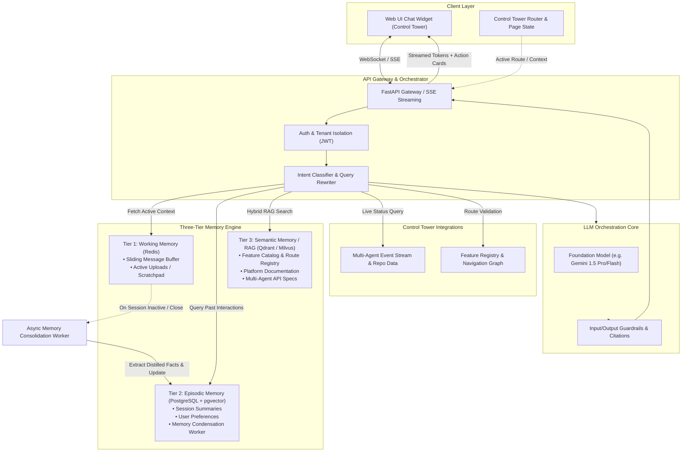
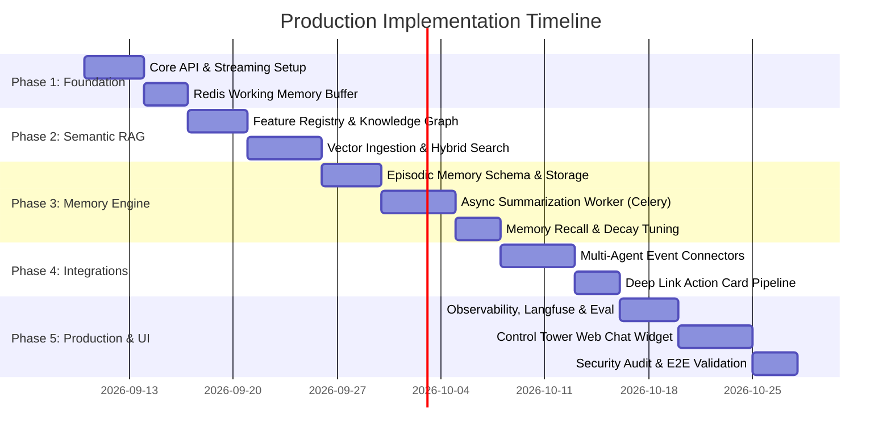

# Implementation Plan: Developer Control Tower Context-Aware AI Chatbot

## 1. Executive Summary & Product Vision

### 1.1 Overview
The **Developer Control Tower AI Assistant** ("TowerBot") is an enterprise-grade, context-aware conversational agent designed to guide software engineers, DevOps leads, and repository maintainers within the **Developer Control Tower** platform.

The Developer Control Tower is a mission control platform where developers manage code repositories, monitor build/test/deployment pipelines, and review automated insights produced by multi-agent AI systems (e.g., Code Reviewer Agents, Security Scanner Agents, CI/CD Orchestrator Agents, and Release Summarizer Agents).

### 1.2 Core Mission
1. **Intelligent Feature Navigation & Locator**: Instantly direct developers to the exact page, setting, or sub-component inside the Control Tower using natural language queries and deep-links.
2. **Contextual Feature Explainer & Workflow Guidance**: Explain what specific features, toggles, or metrics do, and provide step-by-step instructions on performing complex developer tasks.
3. **Project & Multi-Agent Activity Synthesis**: Ingest and summarize real-time telemetry from repositories and background AI agents to provide quick answers to "What happened in the repo today?" or "Why did the test agent fail?".
4. **Three-Tier Persistent Memory Engine**: Seamlessly balance **Working Memory** (immediate session context), **Episodic Memory** (cross-session distilled summaries, developer preferences, past blockers), and **Semantic Memory** (RAG over platform docs, feature registries, and repo catalogs).

---

## 2. User Story & Requirements Analysis

### 2.1 The User Story Breakdown

> **User Story:**
> *"As a developer using the Developer Control Tower, I want a customer support and navigational AI assistant that helps me locate features, explains what specific features do when I'm working inside them, synthesizes multi-agent project updates, and remembers my preferences and past conversations across sessions, so that I can manage my repositories efficiently without friction or repeated explanations."*

### 2.2 Target Personas
| Persona | Goals | Typical Queries |
| :--- | :--- | :--- |
| **Full-Stack Developer** | Discover features, get unblocked on PR workflows, understand agent comments | *"Where do I configure preview environments?", "What does this branch protection policy do?"* |
| **DevOps / Platform Lead** | Audit multi-agent activities, track deployments, configure pipeline triggers | *"Show me all agent-triggered pull requests in repo-backend this week", "Where are the webhook secret configs?"* |
| **New Team Member (Onboarding)** | Learn platform capabilities, understand project status and conventions | *"What is this project's deployment frequency?", "Explain what the Code Health metric means on this screen"* |

### 2.3 Key Use Cases
1. **Feature Locator**: User asks *"Where can I set up Slack notifications for build failures?"* $\rightarrow$ Assistant identifies the feature `Settings > Integrations > Webhooks > Slack`, provides a direct route/URL, and details permissions needed.
2. **Feature Explanation**: User is on the `Agent Orchestration Config` page and asks *"What does 'Auto-Rollback Threshold' do?"* $\rightarrow$ Assistant explains the parameters, safe defaults, and references documentation.
3. **Project / Multi-Agent Status**: User asks *"Give me a status update on repo-payments"* $\rightarrow$ Assistant queries the multi-agent event store and presents a digested summary of recent commits, PR reviews, and pipeline status.
4. **Cross-Session Memory Continuity**: In session 1, user states *"I primarily work on repo-analytics and prefer TypeScript examples."* In session 2 (days later), user asks *"How do I write a custom agent hook?"* $\rightarrow$ Assistant recalls the preference without prompting and outputs TypeScript examples tailored to `repo-analytics`.

### 2.4 Functional & Non-Functional Requirements
- **F-1: Hybrid Intent Routing**: Distinguish between general chat, navigation lookup, feature documentation queries, and live repository telemetry requests.
- **F-2: Multi-Tier Memory**:
  - *Working Memory*: Active session context window + sliding window buffer.
  - *Episodic Memory*: Cross-session persistent distillations, auto-summarization at session close, memory recall with vector search.
  - *Semantic Memory*: Vector search + keyword search (Hybrid RAG) over platform docs, UI feature routes, and agent schemas.
- **F-3: Deep-Link & Action Cards**: Generate structured UI actions (breadcrumbs, buttons, route payloads) alongside conversational responses.
- **NF-1: Response Latency**: Time-to-first-token (TTFT) < 800ms using Server-Sent Events (SSE) streaming.
- **NF-2: Data Privacy & Multi-Tenancy**: Strict tenant/user data isolation; memory entries tagged with `tenant_id` and `user_id`.
- **NF-3: Graceful Degradation & Hallucination Guardrails**: Strict citation to documentation; unknown feature queries gracefully prompt user or offer link to support ticket.
- **NF-4: Token & Cost Efficiency**: Background summarization avoids stuffing raw chat logs into prompts, adhering to a predefined token budget.

---

## 3. Production-Ready System Architecture

### 3.1 Architectural Overview Diagram



### 3.2 Component Breakdown

#### 1. Presentation & Context Awareness Layer
- **Control Tower Chat Widget**: Floating responsive widget with collapsible docked mode.
- **Context Sensor Hook**: Passes the user's current route (`/projects/repo-a/agents/ci-orchestrator`), selected repo ID, active branch, and user role as ambient metadata on every request.

#### 2. API Gateway & Orchestration (FastAPI)
- **Streaming Pipeline**: Server-Sent Events (`/api/v1/chat/stream`) delivering chunks: `text_delta`, `action_card`, `suggested_chips`, and `sources`.
- **Query Rewriter**: Resolves anaphoric references (e.g., *"How do I configure it?"* $\rightarrow$ *"How do I configure CI/CD Orchestrator auto-deploy in repo-payments?"*) using active working memory.

#### 3. Three-Tier Memory Architecture
| Tier | Storage Technology | TTL / Lifespan | Content Stored | Retrieval Mechanism |
| :--- | :--- | :--- | :--- | :--- |
| **Tier 1: Working Memory** | Redis Cluster (Key-Value & Lists) | Active session (TTL: 2 hours sliding) | Raw last $K$ message turns, active file snippets, current page context | Direct list range fetch ($O(1)$) |
| **Tier 2: Episodic Memory** | PostgreSQL + `pgvector` / Vector Store | Permanent (with importance scoring & decay) | Structured fact tuples, user preferences, past problem-solution pairs, session summaries | Semantic similarity + Recency re-ranking |
| **Tier 3: Semantic Memory** | Vector DB (Qdrant / pgvector) + BM25 | Permanent (synced with platform deployments) | Platform documentation, UI navigation graph, feature dictionaries, agent event schemas | Reciprocal Rank Fusion (RRF) Hybrid Search |

#### 4. Asynchronous Memory Consolidation Worker (Background)
- **Trigger**: Runs when a session becomes idle (> 15 minutes) or when user initiates a new session.
- **Process**:
  1. Gathers raw turns from Redis.
  2. Runs a lightweight LLM task to extract:
     - New explicit developer preferences (e.g., favorite repos, tech stack, notification habits).
     - Solved issues and ongoing blockers.
     - High-level 2-3 sentence session distillation.
  3. Deduplicates and merges with existing user knowledge graphs in PostgreSQL.
  4. Flushes raw conversation from Redis.

#### 5. Integration with Multi-Agent Control Tower
- **Event Bus / REST Connectors**: Pulls status from background agents:
  - Commit & PR Summaries
  - Agent Failure Logs & Warnings
  - Pipeline Execution State

---

## 4. Detailed Feature Specifications

### Feature 1: Intelligent Feature Locator & Navigation Deep-Linker
- **Capability**: Resolves natural language queries describing a feature into exact breadcrumbs and navigable links.
- **Data Source**: `feature_registry.json` containing `id`, `name`, `route`, `description`, `required_permissions`, `parent_menu`, `tags`.
- **Response Format**:
  ```json
  {
    "type": "navigation_card",
    "title": "Branch Protection Rules",
    "route": "/repos/:repoId/settings/branches",
    "breadcrumbs": ["Repositories", "Settings", "Branch Rules"],
    "action_label": "Go to Branch Settings",
    "deep_link_params": {"repoId": "repo-payments"}
  }
  ```

### Feature 2: In-Situ Feature Explainer
- **Capability**: Leverages the user's ambient URL/context provided by the UI. If the user simply asks *"What does this switch do?"*, the assistant detects the active page (`/orchestration/triggers`) and retrieves the exact documentation for that view without requiring the user to re-type the context.

### Feature 3: Project & Multi-Agent Activity Synthesis
- **Capability**: Consolidates telemetry from multiple autonomous agents operating on the developer's projects.
- **Sample Queries**:
  - *"What did the Security Agent find on PR #142?"*
  - *"Has the Build Agent finished deployment to staging?"*
- **Mechanism**: Tool call invocation `get_agent_activity(repo_id, agent_type, time_window)` returns sanitized metrics and status summaries.

### Feature 4: Cross-Session Continuity & Preference Tracking
- **Capability**: Preserves user context across multiple days/sessions.
- **Stored Attributes**:
  - Primary working repositories and microservices.
  - Preferred programming languages & tooling.
  - Past encountered platform errors and solutions provided.
- **User Control & Privacy**: Users can view, edit, or purge their stored episodic memories via a "Manage Chatbot Memory" dashboard panel.

---

## 5. Data Models & Database Schemas

### 5.1 Relational Schema (PostgreSQL)

```sql
-- 1. Users & Tenant Context
CREATE TABLE tenants (
    id UUID PRIMARY KEY DEFAULT gen_random_uuid(),
    name VARCHAR(255) NOT NULL,
    created_at TIMESTAMP WITH TIME ZONE DEFAULT NOW()
);

CREATE TABLE users (
    id UUID PRIMARY KEY DEFAULT gen_random_uuid(),
    tenant_id UUID REFERENCES tenants(id) ON DELETE CASCADE,
    email VARCHAR(255) NOT NULL,
    role VARCHAR(50) DEFAULT 'developer',
    created_at TIMESTAMP WITH TIME ZONE DEFAULT NOW()
);

-- 2. Chat Sessions & Messages
CREATE TABLE chat_sessions (
    id UUID PRIMARY KEY DEFAULT gen_random_uuid(),
    user_id UUID REFERENCES users(id) ON DELETE CASCADE,
    tenant_id UUID REFERENCES tenants(id) ON DELETE CASCADE,
    title VARCHAR(255),
    active_route VARCHAR(512),
    created_at TIMESTAMP WITH TIME ZONE DEFAULT NOW(),
    updated_at TIMESTAMP WITH TIME ZONE DEFAULT NOW()
);

CREATE TABLE chat_messages (
    id UUID PRIMARY KEY DEFAULT gen_random_uuid(),
    session_id UUID REFERENCES chat_sessions(id) ON DELETE CASCADE,
    role VARCHAR(20) NOT NULL CHECK (role IN ('user', 'assistant', 'system', 'tool')),
    content TEXT NOT NULL,
    metadata JSONB DEFAULT '{}'::jsonb, -- contains action_cards, tokens, route_context
    created_at TIMESTAMP WITH TIME ZONE DEFAULT NOW()
);

-- 3. Episodic Memory (Cross-Session Knowledge)
CREATE TABLE episodic_memories (
    id UUID PRIMARY KEY DEFAULT gen_random_uuid(),
    user_id UUID REFERENCES users(id) ON DELETE CASCADE,
    tenant_id UUID REFERENCES tenants(id) ON DELETE CASCADE,
    memory_type VARCHAR(50) NOT NULL CHECK (memory_type IN ('preference', 'fact', 'session_summary', 'past_resolution')),
    fact_text TEXT NOT NULL,
    importance_score FLOAT DEFAULT 1.0, -- 0.0 to 1.0
    embedding VECTOR(1536), -- Vector representation for semantic recall
    source_session_id UUID REFERENCES chat_sessions(id) ON DELETE SET NULL,
    created_at TIMESTAMP WITH TIME ZONE DEFAULT NOW(),
    last_accessed_at TIMESTAMP WITH TIME ZONE DEFAULT NOW(),
    decay_factor FLOAT DEFAULT 1.0
);

-- 4. Feature Registry
CREATE TABLE feature_registry (
    id VARCHAR(100) PRIMARY KEY,
    name VARCHAR(255) NOT NULL,
    route_pattern VARCHAR(512) NOT NULL,
    description TEXT NOT NULL,
    keywords TEXT[],
    category VARCHAR(100),
    permission_required VARCHAR(100),
    embedding VECTOR(1536)
);
```

### 5.2 Redis Working Memory Data Structure
- `session:{session_id}:messages` (List of JSON): Recent turns (capped at 10-15 turns to preserve token budget).
- `session:{session_id}:ambient_context` (Hash): `{ "current_route": "/agents/security", "repo_id": "core-backend", "last_active": "timestamp" }`.
- `session:{session_id}:active_uploads` (Set): IDs of files uploaded in this current session.

---

## 6. API Contracts

### 6.1 Chat Stream Endpoint (SSE)
- **POST** `/api/v1/chat/message`
- **Request Body**:
  ```json
  {
    "session_id": "d3b07384-d113-4607-bc32-120000000000",
    "message": "Where do I find the security agent scan results?",
    "ambient_context": {
      "current_route": "/projects/repo-auth",
      "repo_id": "repo-auth",
      "active_branch": "main"
    }
  }
  ```
- **Stream Output Events**:
  ```text
  event: metadata
  data: {"session_id":"d3b07384...","intent":"feature_lookup"}

  event: token
  data: {"delta":"You can find the security scan results "}

  event: token
  data: {"delta":"under the Security & Compliance tab for repo-auth."}

  event: action_card
  data: {"type":"navigation","title":"Security Scan Results","route":"/projects/repo-auth/security/scans"}

  event: done
  data: {"total_tokens": 142}
  ```

### 6.2 Episodic Memory Management Endpoints
- **GET** `/api/v1/memories`: Retrieve list of stored memories for current user.
- **DELETE** `/api/v1/memories/{memory_id}`: User can delete any specific remembered fact.
- **POST** `/api/v1/memories/feedback`: Rate relevance of recalled context.

---

## 7. Implementation Roadmap & Phased Execution



### Phase 1: Core API & Working Memory (Days 1–7)
- [ ] Initialize Python/FastAPI project structure with clean domain-driven design (`app/api`, `app/services`, `app/memory`, `app/rag`, `app/schemas`).
- [ ] Setup Redis connection pool and implement sliding window buffer with token counter.
- [ ] Implement SSE streaming handler with structured event dispatching (`token`, `action_card`, `error`).
- [ ] Setup LLM client provider interface with fallback support.

### Phase 2: Feature Knowledge Base & Semantic RAG (Days 8–16)
- [ ] Model the Developer Control Tower feature registry (`features.json` / Database).
- [ ] Implement Hybrid Search engine (BM25 keyword search + Vector embeddings via `pgvector` / Qdrant).
- [ ] Ingest documentation markdown files (routes, permissions, feature guides, FAQs).
- [ ] Build Feature Locator tool: given user query, return closest matched routes and confidence score.

### Phase 3: Episodic Memory Engine & Async Consolidation (Days 17–28)
- [ ] Implement `EpisodicMemoryService` for storing and fetching user memories.
- [ ] Build `MemoryRetriever` that executes prior to LLM generation: selects top $K$ relevant memories based on similarity to current query + recency penalty.
- [ ] Implement Celery/Redis background worker for memory consolidation:
  - Extracts distilled facts upon session inactivity.
  - Detects duplicate facts or conflicts (e.g., user changed preferred repo).
  - Implements importance scoring and decay.
- [ ] Build user-facing CRUD endpoints for memory transparency (`/api/v1/memories`).

### Phase 4: Control Tower & Multi-Agent Telemetry Integration (Days 29–36)
- [ ] Implement mock and live adapters for Control Tower's AI Agents:
  - Code Review Agent stats connector.
  - CI/CD Build & Test Agent log summary connector.
  - Release Orchestrator state connector.
- [ ] Enable Tool Calling / Function Calling in the LLM router so it can invoke telemetry queries dynamically when requested by user.
- [ ] Emit structured UI action cards (navigation buttons, commit diff links, error highlights).

### Phase 5: Observability, Evaluation & UI Integration (Days 37–48)
- [ ] Integrate OpenTelemetry & Langfuse for tracing LLM latencies, prompt costs, and retrieval quality.
- [ ] Implement Ragas evaluation framework to benchmark:
  - *Context Recall* (Are correct memories retrieved?)
  - *Faithfulness* (Are feature descriptions grounded in actual docs?)
  - *Answer Relevance* (Does it solve the developer's navigation need?)
- [ ] Build the frontend web chat widget (React / Vanilla JS with modern glassmorphic theme, markdown rendering, code block highlighting, and action cards).
- [ ] Execute security audits: PII masking, prompt injection defenses, tenant boundary verification.

---

## 8. Verification, Testing & Evaluation Strategy

### 8.1 Automated Test Suites
1. **Unit Tests**:
   - `test_working_memory_buffer.py`: Verifies message trimming stays within max token bounds.
   - `test_memory_decay.py`: Verifies exponential decay algorithms for old memories.
   - `test_feature_locator.py`: Validates fuzzy and semantic matching against known feature prompts.
2. **Integration Tests**:
   - Multi-turn conversation simulation: User introduces themselves in session 1; session ends; consolidation runs; session 2 verifies model greets user and recalls preference.
   - Streaming SSE integrity: Verifies tokens and JSON action frames are valid and parseable by the client.
3. **End-to-End Evaluation Benchmark (Ragas / LLM-as-a-Judge)**:
   - Run 100 canonical test queries across 4 categories:
     1. Navigation / Feature finding
     2. Feature explanation
     3. Project status & multi-agent reporting
     4. Cross-session personalized queries
   - Target benchmark metrics:
     - **Faithfulness**: $\ge 0.92$
     - **Answer Relevance**: $\ge 0.90$
     - **Context Recall**: $\ge 0.88$
     - **Hallucination Rate**: $< 2\%$

---

## 9. Risk Matrix & Mitigations

| Risk | Impact | Probability | Mitigation Strategy |
| :--- | :--- | :--- | :--- |
| **Token Bloat & Cost Runaway** | High | High | Strict token budget on Working Memory; async condensation transforms full transcripts into compact 1-line facts; sliding window truncation. |
| **Hallucinated Feature Routes** | High | Medium | Strict grounding: The assistant cannot fabricate URLs; links are strictly populated from the validated `FeatureRegistry` database via tool calls. |
| **Stale Episodic Memory** | Medium | Medium | Conflict resolution in memory worker: If user specifies a new preference, update existing record instead of appending contradictory entries; provide "Forget Memory" UI. |
| **Cross-Tenant Data Leakage** | Critical | Low | Hard tenant separation: Every query in Redis, Postgres, and Vector DB is scoped by `tenant_id` and enforced in SQL `WHERE` clauses and vector payload filters. |
| **Multi-Agent Telemetry Lag** | Medium | Medium | Implement short-term Redis caching (30s) on agent telemetry queries to avoid hitting live databases repeatedly. |

---

## 10. Conclusion & Immediate Next Steps

This plan establishes a production-grade blueprint for the **Developer Control Tower AI Chatbot**, solving the exact user story by combining:
1. **Feature Navigation & Explanation** tailored for the Control Tower.
2. **Multi-Agent Project Status Reporting**.
3. **Three-Tier Architecture (Working, Episodic, Semantic Memory)** that retains cross-session continuity without token bloat.

**Recommended First Milestone**:
Initialize Phase 1 and Phase 2 scaffolds, establish the project directory layout, and implement the Working Memory + Feature Registry RAG pipeline.
